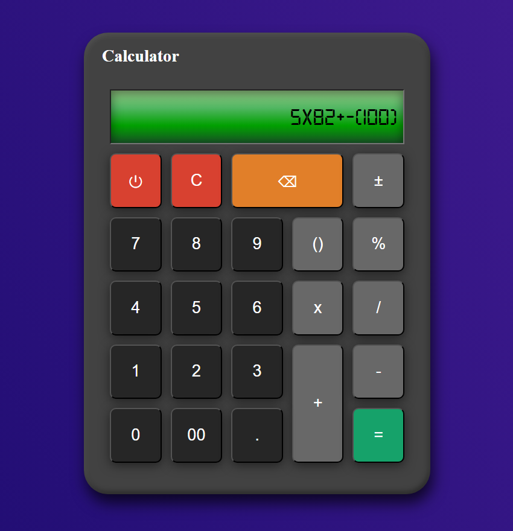
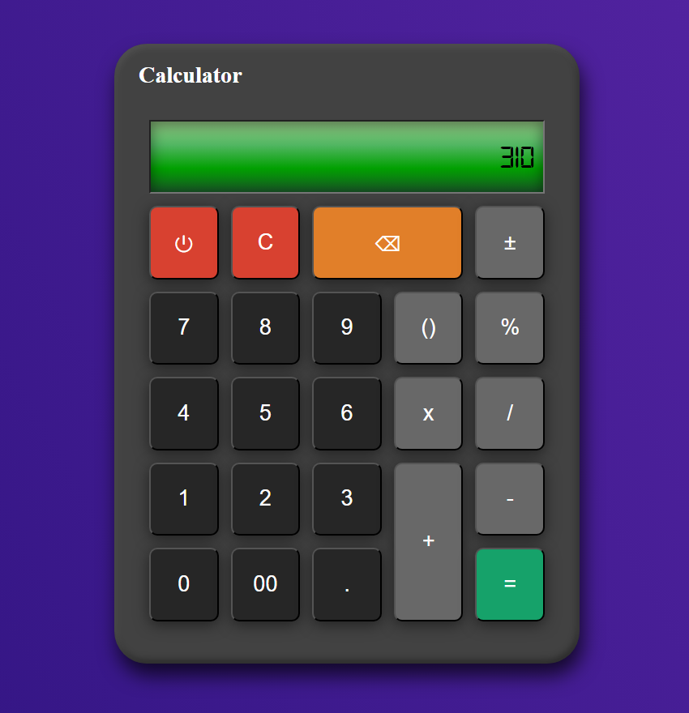

# Calculator App

A simple calculator built with React, TypeScript, and Vite, featuring a classic digital style with realistic styling and a retro aesthetic.

## Features

- Basic arithmetic operations: addition, subtraction, multiplication, division
- Brackets and sign toggle functionality
- Decimal point support
- Error handling for invalid expressions
- Power on/off toggle
- Responsive design with digital font

## Tech Stack

- **Language**: TypeScript
- **Framework**: React
- **Build Tool**: Vite
- **Library**: mathjs (for mathematical expression evaluation)
- **Styling**: CSS with custom digital font
- **Linting**: ESLint

## Screenshots

 


## Installation

1. Clone the repository:
```bash
git clone https://github.com/BasemGhasan/Calculator.git
```
2. Install dependencies:
```bash
npm install
```
3. Run the development server:
```bash
npm start
```

## 🌐 Live Demo

Experience the project live at: https://BasemGhasan.github.io/Calculator/
